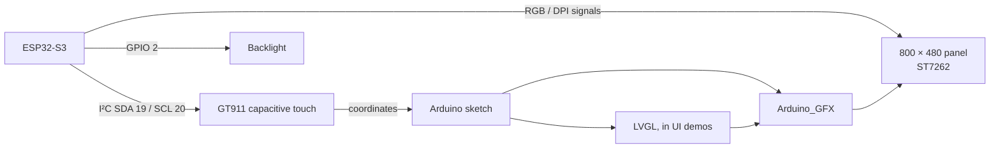

# ESP32-8048S050C · Board & Archive Guide

A practical guide to the **ESP32-8048S050C**, the 5-inch ESP32-S3 display board with a capacitive touchscreen. This repository contains the manufacturer archive, extracted files, board references, sample firmware, and Arduino examples.

> **Board context:** The target here is the **capacitive touch (C/CTP) version**. The archive also contains similarly named materials and projects. Confirm that a firmware image or touch configuration is for CTP before using it.

## Start here

1. Check the [board at a glance](#board-at-a-glance) and the [hardware signal map](#hardware-signal-map).
2. Follow [first bring-up](#first-bring-up) for a low-risk display and touch path.
3. Pick a [demo by purpose](#demo-index) and use its sketch folder as the Arduino IDE project.
4. Refer to [flashing factory firmware](#factory-firmware-and-flashing) only when you want the supplied demo image.
5. Use the [archive map](#archive-map) to find the board specification, schematics, datasheets, and tools.

## Board at a glance

| Subsystem | What the archive identifies |
|---|---|
| MCU | ESP32-S3 module |
| Display | 5-inch, 800 × 480 RGB/DPI panel; ST7262 named in demo comments |
| Touch | GT911 capacitive touch controller (CTP) |
| Display software path | Arduino_GFX RGB panel setup; LVGL in selected demos |
| Touch software path | GT911 over I²C; demo-specific `touch.h` glue |
| Example framework | Arduino sketches |

### How the pieces connect



**Practical distinction:** the LCD is driven as a parallel RGB/DPI panel. The supplied examples configure the bus and timing through `Arduino_ESP32RGBPanel` and `Arduino_RPi_DPI_RGBPanel`; they do not call a separate ST7262 driver file. Touch is a separate GT911 I²C path.

## Repository contents

```text
.
├── README.md                         # this procedural guide
├── 5.0inch_ESP32-8048S050.zip        # original manufacturer archive
├── extracted/5.0inch_ESP32-8048S050/
│   ├── 1-Demo/Demo_Arduino/           # sketches and bundled libraries
│   ├── 2-Specification/               # board specification PDF
│   ├── 3-Structure_Diagram/            # dimensions / structure images
│   ├── 4-Driver_IC_Data_Sheet/         # component datasheets
│   ├── 5-Schematic/                   # raster schematic sheets
│   ├── 6-User_Manual/                  # getting-started guide
│   ├── 7-Character&Picture_Molding_Tool/
│   └── 8-Burn operation/               # firmware, flashing tools and guides
├── CODE-INDEX.md                       # detailed code inventory
└── FILE-MANIFEST.txt                   # extracted file listing
```

The `extracted/` tree is present, so there is no need to unpack the ZIP for normal browsing. Later sections walk through the hardware, setup, demos, and recovery workflow one step at a time.

## Hardware signal map

The pin map below is taken from the manufacturer’s Arduino display examples. Treat it as board wiring, not as a suggestion for freely reassigned GPIOs: the display consumes many pins.

| Signal | ESP32-S3 GPIO |
|---|---:|
| Backlight enable (`TFT_BL`) | 2 |
| Display DE / VSYNC / HSYNC / PCLK | 40 / 41 / 39 / 42 |
| Display R0–R4 | 45, 48, 47, 21, 14 |
| Display G0–G5 | 5, 6, 7, 15, 16, 4 |
| Display B0–B4 | 8, 3, 46, 9, 1 |
| GT911 I²C SDA / SCL | 19 / 20 |
| GT911 reset / interrupt | 38 / unused in demo config |

```text
Arduino sketch
  ├─ Arduino_GFX RGB bus ─── GPIO RGB + sync ─── 800×480 LCD
  ├─ GPIO 2 ──────────────────────────────────── backlight
  └─ Wire (SDA 19, SCL 20) ── GT911 ─────────── touch coordinates
```

The examples set 800 × 480 geometry and commonly use 8/4/8 horizontal and vertical porch values, negative active pixel clock, and a preferred clock around 12–16 MHz. Copy the complete working constructor from a display sketch instead of piecing together timing values. Small timing differences across demos are possible.

## First bring-up

### 1. Prepare the toolchain

The supplied application examples are Arduino sketches. The archive does not provide a first-party ESP-IDF app or a PlatformIO project file. Install an Arduino IDE with ESP32-S3 board support, connect the board over USB, and select the ESP32-S3 board target exposed by your installed core. The vendor archive does not state a single tested core version, so retain the working version once you have a successful build.

> The archive includes Windows utilities and bundled libraries. You do not need to run the flash utility to build an Arduino sketch.

### 2. Open the simplest display example

Open this sketch from its own folder:

`extracted/5.0inch_ESP32-8048S050/1-Demo/Demo_Arduino/3_3-1_TFT_HelloWorld/HelloWorld/HelloWorld.ino`

The sketch sets up `Arduino_ESP32RGBPanel`, creates an `Arduino_RPi_DPI_RGBPanel` at 800 × 480, starts the graphics driver, and drives GPIO 2 high for the backlight. This is a useful first check because it isolates display output from LVGL and touch.

### 3. Build and upload

1. Confirm the IDE sees the ESP32-S3 board and the connected serial port.
2. Open the sketch from the folder containing its `.ino` file.
3. Resolve missing Arduino_GFX dependencies using the bundled library under `1-Demo/Demo_Arduino/Libraries/Arduino_GFX-master/` or the matching library available to your IDE.
4. Compile, then upload over USB using the IDE.
5. Open the serial monitor only if the sketch emits serial output; the basic TFT example is primarily visual.

If compilation reports a missing include, check that the sketch’s associated files and the vendor library folder are available to the IDE. Preserve the directory layout: LVGL demos also rely on local headers, image sources, and an `lv_conf.h` configuration.

### 4. Add capacitive touch

After the display works, open the LVGL Widgets demo:

`extracted/5.0inch_ESP32-8048S050/1-Demo/Demo_Arduino/3_3-4_TFT-LVGL-Widgets/LvglWidgets/LvglWidgets.ino`

Keep its adjacent `touch.h` and the vendor GT911 library available. The demo starts I²C on SDA 19 / SCL 20, configures reset GPIO 38, and maps GT911 coordinates to the display. Its code includes alternate coordinate paths and orientation mapping; when touches are mirrored or rotated, adjust the mapping/orientation there rather than changing the physical pin map.

### Bring-up checkpoints

| Checkpoint | Expected result | If it fails, inspect |
|---|---|---|
| USB / serial port | Board enumerates on host | Cable, port selection, USB driver |
| Display upload | IDE finishes upload and board restarts | Board target, boot/upload mode, selected port |
| Backlight | Panel visibly lights | GPIO 2 setup and board power |
| RGB output | Text or solid color appears | Full RGB pin map, panel constructor, timing |
| Touch | Widget demo responds to taps | GT911 library, I²C pins, reset, coordinate mapping |

## Demo index

Choose a demo by the feature you want to bring up. All paths below are relative to `extracted/5.0inch_ESP32-8048S050/1-Demo/Demo_Arduino/`.

| Goal | Demo folder / entry sketch | Notes |
|---|---|---|
| Serial heartbeat | `3_1_Helloworld/3_1_Helloworld.ino` | Prints over UART; no display setup |
| UART exercise | `3_2_Uart/3_2_uart.ino` | Serial interface example |
| First screen | `3_3-1_TFT_HelloWorld/HelloWorld/HelloWorld.ino` | Recommended display starting point |
| Graphics / clock | `3_3-2_TFT-CLOCK/Clock/Clock.ino` | Drawing and clock layout |
| Display performance | `3_3-3-TFT-LVGL-Benchmark/LvglBenchmark/LvglBenchmark.ino` | LVGL benchmark; needs its configuration file |
| Raw graphics performance | `3_3-3_TFT_PDQgraphicstest/PDQgraphicstest/PDQgraphicstest.ino` | Arduino_GFX drawing benchmark |
| Touch + UI | `3_3-4_TFT-LVGL-Widgets/LvglWidgets/LvglWidgets.ino` | Best touch validation example |
| Wi-Fi | `4_1_Wifi_AP/`, `4_2_Wifi_STA/`, `4_3_Wifi_SmartConfig/` | AP, station, provisioning |
| Network sockets | `4_4_Wifi_STA_TCP_Server/`, `4_5_WIFI_STA_TCP_Client/`, `4_6_WIFI_STA_UDP/` | TCP server/client and UDP |
| Web server | `4_7_WIFI Web Servers LED/`, `4_8_WIFI Web Servers Relay/`, `4_9_WIFI Web Servers DHT11/` | HTTP examples; check external wiring before using relay/sensor GPIOs |
| BLE | `5_1_BleService/5_1_bleService.ino` | BLE GATT service example |
| Audio | `6_1_Audio_test.ino/Audio_test.ino/Audio_test.ino.ino` | Nested sketch path; archive layout is unusual |
| Music player | `7_1_lvgl_music_gt911_5.0/` | LVGL, GT911, Wi-Fi audio; includes large embedded image sources |
| Music + SD + Blinker | `8_1_lvgl_music_gt911_5.0__sd_with_blink/` | Adds SD and Blinker dependencies; verify pin definitions before adapting |

For a normal Arduino project, open the `.ino` file from the matching project directory and keep companion source files beside it. The top-level `Libraries/` folder is a collection of dependencies and examples, not a single project to compile as firmware.

## Factory firmware and flashing

The archive contains a merged capacitive-touch image at:

`extracted/5.0inch_ESP32-8048S050/8-Burn operation/Burn files/5inch LVGL CTP.bin`

Use it when you want to restore or try the vendor LVGL CTP demo without building a sketch. The vendor also includes Espressif Flash Download Tool 3.9.3, burn-operation instruction images, and sample component binaries. The image is archived firmware; this guide does not claim it has been tested on your board revision.

### Flashing sequence

1. Read the vendor’s `Burn operation instructions/Burn operation-*.png` files before connecting the flash utility.
2. Use the supplied **CTP** image for the capacitive-touch board. Avoid selecting an NTP / resistive-touch image just because the product number looks similar.
3. Follow the address and connection settings shown in the included burn instructions. The archive's `地址.txt` describes offsets for the separate `WiFiScan` sample components; those offsets are not a substitute for the instructions for the merged `5inch LVGL CTP.bin` image.
4. Connect the board and run the flash utility on a compatible Windows system, selecting the correct serial port and settings from the guide.
5. Start the download and wait for the utility to report completion before resetting or disconnecting the board.

The archive lists `5inch LVGL CTP.bin` as 617,536 bytes. The separate sample files include a bootloader, partition table, OTA selector, and `WiFiScan` app image. Do not combine those sample offsets with the merged image workflow.

## Libraries and project structure

The bundled libraries live under `1-Demo/Demo_Arduino/Libraries/`:

| Library | Purpose in this archive |
|---|---|
| `Arduino_GFX-master` | RGB display bus and drawing layer used by display demos |
| `lvgl` | UI framework used by benchmark, widgets, and music examples |
| `Touch_GT911` | Vendor GT911 touch driver |
| `Gt911-arduino-main` | Alternate GT911 driver and touch-print example |
| `ESP32-audioI2S-master` | Audio playback support used by music examples |
| `blinker-library-master` | Blinker framework used by the SD music demo |
| `TFT_eSPI_original` | Generic TFT_eSPI library; the board demos use Arduino_GFX RGB instead |
| `Regexp-master` | Helper library bundled with examples |

### Building on the vendor examples

1. Copy the closest demo as a complete Arduino sketch folder.
2. Keep its `.ino`, local `.h` / `.cpp` files, and assets together.
3. Keep the board-specific display constructor and GT911 setup intact while first changing UI behavior.
4. For LVGL, carry over the matching `LVGL configuration replacement file/lv_conf.h` and ensure the compiler includes the correct config.
5. Add external libraries only when the selected demo requires them; the two music demos have more dependencies and much larger asset trees than the basic graphics examples.
6. Record any pin changes in your project notes and compare them with the board schematic before attaching peripherals.

The code archive has Arduino demos but no first-party PlatformIO project or application-level ESP-IDF project. LVGL and other bundled dependencies may contain ESP-IDF metadata; that does not make the included board demo an ESP-IDF application.

## Archive map and reference documents

| Folder | Contents | Use it for |
|---|---|---|
| `2-Specification/` | English board specification PDF | Published board summary and ratings |
| `3-Structure_Diagram/` | Structure and dimensions images | Enclosure/mechanical planning |
| `4-Driver_IC_Data_Sheet/` | LCD, ESP32-S3/module, and AX98357A datasheets | Component-level electrical details |
| `5-Schematic/` | MCU and LCD schematic images; module pinout image | Board wiring and GPIO review |
| `6-User_Manual/` | `Getting started 5.0 Inch.pdf` | Vendor setup instructions |
| `7-Character&Picture_Molding_Tool/` | Windows tools and compressed utilities | Asset/font conversion and serial utilities |
| `8-Burn operation/` | Firmware images, Windows flasher, logs, burn guides | Factory firmware recovery |

The schematics are raster JPG/PNG images; there are no editable EDA source files in the supplied archive. See [CODE-INDEX.md](CODE-INDEX.md) for per-demo entry points and library notes, and [FILE-MANIFEST.txt](FILE-MANIFEST.txt) for the extracted file inventory. `SHA256SUMS.txt` records hashes for the archive contents present when this repository was indexed.

## Troubleshooting guide

| Symptom | First checks |
|---|---|
| Backlight off | Board power, GPIO 2 output and `HIGH` level in sketch |
| Backlight on, no image | RGB bus pin order, sync pins, geometry, panel timing, successful `gfx->begin()` |
| Image shifted, unstable, or blank | Start from the full vendor constructor; avoid mixing timing from different demos |
| Touch never responds | Use the capacitive GT911 configuration; check SDA 19, SCL 20, reset 38, and I²C initialization |
| Touch is mirrored / rotated | Inspect `touch.h` coordinate mapping and rotation for the selected demo |
| Missing header at compile time | Keep local demo files together and expose the correct bundled library to Arduino IDE |
| LVGL config or symbol errors | Use the demo's `lv_conf.h` and matching LVGL setup; avoid mixing configuration with a different LVGL copy |
| Upload fails | Verify board target and serial port; follow the manual's boot/upload procedure for the connected board |
| Demo compiles but external feature fails | Check required sensor, SD card, network credentials, or audio setup; some examples need hardware beyond the display board |

## Board-specific cautions from the archive

- The 5-inch board family has CTP and other touch variants. The supplied CTP factory image is explicitly labeled `5inch LVGL CTP.bin`; use touch code configured for GT911.
- A filename such as `JC8048B050N_I.pdf` may describe a panel without capacitive touch; do not infer the fitted touch variant from that LCD panel datasheet alone.
- Demo comments and board identifiers sometimes use `ESP32-8048S050` without the C suffix. Verify the pin map and touch controller from the actual board documentation and schematics.
- In the SD music demo, the backlight signal appears under inconsistent GPIO definitions in the archived source. Treat the basic display demo's GPIO 2 mapping and the schematic as the reference.
- Flash instructions and factory firmware are provided for reference; confirm the correct image and settings before writing flash.

---

Content generated by `openai/gpt-6-luna` using `codex` inside an archived repository. Ask [me](https://github.com/lordofthesticks0)
